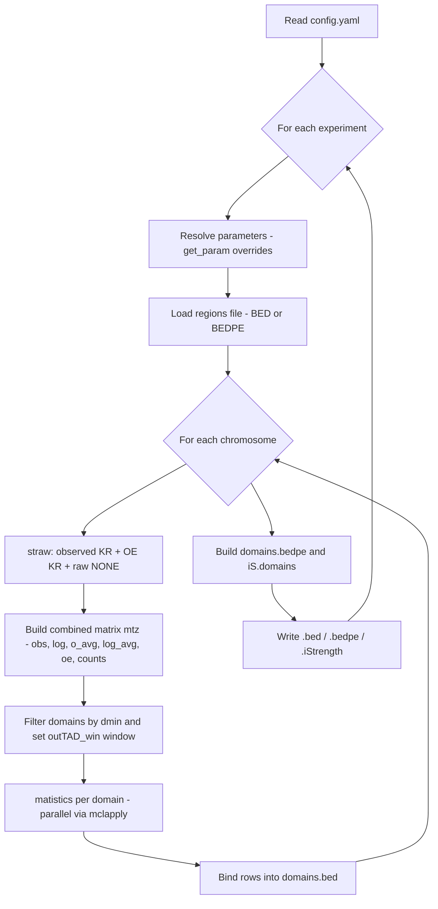

# iStrength

**iStrength** is an R script to quantify chromatin interaction enrichment from
Hi-C data at the boundaries of genomic domains (TADs), together with their
associated stripes and loops.

For every domain it reports:

- **Boundary insulation strength** (`iStrength`) at the start and end boundaries.
- **Intra-domain** vs **inter-domain** contact signal.
- **Stripe** signal (upstream / downstream) and stripe-to-background ratios.
- **Loop** signal between domain anchors and loop-to-background ratios.
- All of the above under several normalizations: **observed (KR)**,
  **observed/expected (OE)**, **log**, **mean-scaled** and **median**.

---

## Table of contents

- [Concept](#concept)
- [Requirements & installation](#requirements--installation)
- [Quick start](#quick-start)
- [Configuration (`config.yaml`)](#configuration-configyaml)
- [Input files](#input-files)
- [How it works](#how-it-works)
  - [Pipeline overview](#pipeline-overview)
  - [Metric geometry on the contact matrix](#metric-geometry-on-the-contact-matrix)
  - [The iStrength formula](#the-istrength-formula)
  - [Stripe and loop ratios](#stripe-and-loop-ratios)
- [Output files](#output-files)
- [Metrics catalog](#metrics-catalog)
- [Performance notes](#performance-notes)
- [Citation](#citation)
- [Author & license](#author--license)

---

## Concept

A TAD (Topologically Associating Domain) is a self-interacting genomic region.
Its **boundaries** insulate it from neighboring domains. iStrength measures how
"sharp" each boundary is by comparing **intra-domain** contacts (signal that
stays inside the domain) against **inter-domain** contacts (signal that crosses
the boundary).

```
        upstream flank          DOMAIN (TAD)           downstream flank
   <----- outTAD_win ----->|<================>|<----- outTAD_win ----->

   ............[ START boundary ]........[ END boundary ]............
                    ^                          ^
                    |                          |
            iStrength_start             iStrength_end

   Intra-domain (====) : contacts kept inside the domain   -> high at strong boundaries
   Inter-domain (----) : contacts crossing the boundary    -> high at weak boundaries
```

A **strong** boundary has high intra-domain and low inter-domain signal, so
`iStrength` approaches `+1`. A **weak / absent** boundary lets contacts cross,
so `iStrength` approaches `0` (or below).

---

## Requirements & installation

- **R** (>= 4.0 recommended)
- R packages:
  - [`data.table`](https://cran.r-project.org/package=data.table)
  - `parallel` (base R)
  - [`matrixStats`](https://cran.r-project.org/package=matrixStats)
  - [`yaml`](https://cran.r-project.org/package=yaml)
  - [`strawr`](https://github.com/aidenlab/straw) — reads `.hic` files

Install the CRAN packages:

```r
install.packages(c("data.table", "matrixStats", "yaml", "remotes"))
```

Install `strawr` (Aiden Lab straw, R interface):

```r
remotes::install_github("aidenlab/straw/R")
```

---

## Quick start

```bash
Rscript iStrength.R config/config.yaml
```

The script takes **one argument**: the path to the YAML configuration file.
It then iterates over **every** experiment defined under the `experiments:`
block and writes one set of outputs per experiment.

---

## Configuration (`config.yaml`)

The config has two sections: `general` (defaults shared by all experiments) and
`experiments` (one block per Hi-C sample). Any parameter set inside an
experiment **overrides** the value in `general` (resolved by the internal
`get_param()` helper).

```yaml
general:
  genome: mm10                     # mm10 | hg38 | mm10_test
  hic_directory: /path/to/hic/     # folder containing the .hic files
  regions_directory: /path/to/bed/ # folder containing the regions file
  regions: domains.bed             # regions file name (BED or BEDPE)
  skiping: 0                       # header lines to skip in the regions file
  regions_header: FALSE            # does the regions file have a header row?
  pairfile: bed                    # bed | bedpe
  cores: 4                         # cores for parallel processing (mclapply)
  resolution: 5000                 # Hi-C bin size in bp
  choose_window: ratio             # ratio | fixed (how outTAD_win is defined)
  window_ratio: 0.5                # if 'ratio': flank = domain_length * ratio
  window: 50000                    # if 'fixed': flank length in bp
  stripe_width: 10000              # stripe thickness in bp
  dmin: 15000                      # minimum domain length to keep (bp)
  window_anchors_in: 10000         # loop anchor window, inside the domain
  window_anchors_out: 10000        # loop anchor window, outside the domain
  keep_id: true                    # keep IDs from the regions file (else auto-generate)
  # metrics: [iStrength, tad, loop_ratio_oe] # optional: families or exact names (default: all)

experiments:
  WT:
    hic_file: sample_WT.hic
    output_name: WT
  KO:
    hic_file: sample_KO.hic
    output_name: KO
```

### Parameter reference

| Parameter | Section | Type | Description |
|---|---|---|---|
| `genome` | general | enum | Chromosome sizes table: `mm10`, `hg38`, `mm10_test`. |
| `hic_directory` | general | path | Directory holding the `.hic` files. |
| `regions_directory` | general | path | Directory holding the regions file. |
| `regions` | general/exp | file | Regions file name (BED or BEDPE). |
| `skiping` | general | int | Number of lines to skip when reading the regions file. |
| `regions_header` | general | bool | Whether the regions file has a header row. |
| `pairfile` | general | enum | `bed` (3–4 cols) or `bedpe` (6–7 cols). |
| `cores` | general | int | Number of cores for `mclapply`. |
| `resolution` | general | int | Hi-C bin size (bp). All windows are rounded to this. |
| `choose_window` | general | enum | `ratio` → flank = `length * window_ratio`; `fixed` → flank = `window`. |
| `window_ratio` | general | float | Flank size as a fraction of domain length (used when `ratio`). |
| `window` | general | int | Fixed flank size in bp (used when `fixed`). |
| `stripe_width` | general | int | Stripe thickness in bp (rounded to bins). |
| `dmin` | general | int | Domains shorter than this are discarded. |
| `window_anchors_in` | general | int | Loop anchor window reaching **into** the domain. |
| `window_anchors_out` | general | int | Loop anchor window reaching **outside** the domain. |
| `keep_id` | general/exp | bool | `true` keeps regions-file IDs; `false` auto-generates them. |
| `metrics` | general/exp | list | Optional. Metric groups to write (matched as column prefixes). Omit to write **all** columns. |
| `hic_file` | exp | file | `.hic` file for this experiment. |
| `output_name` | exp | string | Used to name the output folder and files. |

> **`metrics` selection.** Each entry is matched as a **column-name prefix**, so
> you can paste a whole family (e.g. `iStrength`, `loop`) or exact column names
> (e.g. `iStrength_start_oe`, `loop_ratio_oe`). See the
> [Metrics catalog](#metrics-catalog) for every selectable token. The coordinate
> columns `chr`, `start`, `end`, `id` are always kept, and this only affects the
> `.bed` / `.bedpe` outputs (the `.iStrength` summary stays complete).

---

## Input files

### Hi-C matrix (`.hic`)

For each chromosome the script extracts three matrices with `strawr::straw`:

| Matrix | Normalization | straw call |
|---|---|---|
| Observed | `KR` | `straw("KR", ..., matrix="observed")` |
| Observed/Expected | `KR` | `straw("KR", ..., matrix="oe")` |
| Raw counts | `NONE` | `straw("NONE", ..., matrix="observed")` |

From the observed matrix it also derives `log = log10(obs + 1)`,
a mean-scaled value `o_avg = obs / avg`, and `log_avg = log10(o_avg + 1)`,
where `avg` is the chromosome-wide average contact per bin pair.

### Regions file

Two layouts are supported, controlled by `pairfile`:

**BED** (`pairfile: bed`)

```
chr   start   end   id
```

Domain start/end are floored to the resolution.

**BEDPE** (`pairfile: bedpe`)

```
chr1   start1   end1   chr2   start2   end2   id
```

Each anchor is collapsed to its midpoint, then floored to the resolution.

> A leading `chr` prefix in the chromosome column is stripped automatically.
> If `keep_id: false`, IDs are generated as `<output_name>_chr<chr>_<n>`.

---

## How it works

### Pipeline overview



The per-domain worker is the `matistics()` function. It runs in parallel across
domains (one task per domain, `cores` workers) and returns one row of metrics.

### Metric geometry on the contact matrix

All extraction happens on the **upper triangle** of the intra-chromosomal
contact matrix (`x < y`, where `x` and `y` are genomic coordinates in bp).
For each domain boundary the script samples three regions:

```
   y (downstream)
   ^
   |        upTAD            <- square just before the boundary  (intra)
   |        +--------+
   |        |  ====  |
   |   inter|--------|       <- rectangle straddling the boundary (inter)
   |        |  ----  |
   |        +--------+
   |        downTAD          <- square just after the boundary   (intra)
   |
   +-----------------------------> x (upstream)
              ^
          boundary
```

- **upTAD**  : contacts within the `outTAD_win` window *before* the boundary.
- **downTAD**: contacts within the `outTAD_win` window *after* the boundary.
- **interTAD**: contacts in the rectangle that crosses the boundary
  (upstream bins × downstream bins) — i.e. signal that "leaks" across.

This is computed independently at the **start** boundary and the **end**
boundary of every domain, each with `obs`, `log`, `oe`, and `median` variants.

Additional features sampled per domain:

```
   Whole TAD          : every bin pair inside [start, end]            -> tad_*
   Up-stripe          : first `stripe_bins` rows spanning the domain  -> up_stripe_*
   Down-stripe        : last  `stripe_bins` cols spanning the domain  -> down_stripe_*
   Anchor (loop)      : start-anchor x end-anchor corner of the TAD   -> loop_*
   Background         : TAD minus stripes minus loop anchors          -> denominator
```

### The iStrength formula

For each boundary, intra-domain signal is the sum of the two flanking squares,
and inter-domain signal is the crossing rectangle:

$$
\text{intra} = \text{upTAD} + \text{downTAD}
$$

$$
\text{iStrength} = \frac{\text{intra} - \text{inter}}{\text{intra} + \text{inter}}
$$

Interpretation:

- `iStrength → +1` : strong insulating boundary (little cross-boundary signal).
- `iStrength → 0`  : weak boundary (intra ≈ inter).
- Negative values  : inter-domain contacts dominate (boundary effectively absent).

The same ratio is computed on `obs`, `oe`, `log`, and on `median`-aggregated
signal to make the metric robust to outliers and to depth differences.

### Stripe and loop ratios

Stripe and loop strengths are reported both as raw means and as ratios over a
**background** equal to the TAD interior after removing the stripe bins and the
loop-anchor bins (`tad.no_stripes.no_loop`):

$$
\text{up-stripe ratio} = \frac{\text{up-stripe}}{\text{background}}
$$

$$
\text{loop ratio} = \frac{\text{loop}}{\text{background}}
$$

A ratio `> 1` means the feature is enriched relative to the bulk of the domain.

---

## Output files

Results are written to:

```
iStrength/<output_name>/<resolution>/
```

| File | Description |
|---|---|
| `<output_name>.iS_<window_label>.res_<r>kb.bed` | Full per-domain metric table (all columns). |
| `<output_name>.iS_<window_label>.res_<r>kb.bedpe` | Paired-anchor (BEDPE) representation of each domain plus all metrics. |
| `<output_name>.iS_<window_label>.res_<r>kb.iStrength` | One row per **boundary** (start = `Up`, end = `Down`), focused on iStrength values. |

`window_label` is `<window_ratio>_TADLength` when `choose_window: ratio`, or
`<window/1000>_kb` when `choose_window: fixed`.

---

## Metrics catalog

This is the complete list of selectable metrics. In `config.yaml` you can paste
either a **family prefix** (e.g. `loop`, which selects every `loop_*` column) or
**exact column names** (e.g. `loop_ratio_oe`). The coordinate columns `chr`,
`start`, `end`, `id` are always written.

**Normalization suffixes** (shared across families):

| Suffix | Meaning |
|---|---|
| `_counts` | raw counts (`NONE`) |
| `_obs` | observed, KR-normalized |
| `_oe` | observed / expected (KR) |
| `_o_avg` | `obs` scaled by the chromosome-wide mean |
| `_log` | `log10(obs + 1)` |
| `_log_avg` | `log10(o_avg + 1)` |
| `_median` | aggregated with the median instead of the mean |
| `_start` / `_end` | measured at the start / end boundary |

**Meta**

| Metric | Description |
|---|---|
| `length` | Domain length in bp. |
| `outTAD_win` | Flank window used for the boundary regions (bp). |
| `avg` | Chromosome-wide mean contact per bin pair. |

**Boundary components** — families `upTAD`, `downTAD`, `interTAD`

| Metric | Description |
|---|---|
| `upTAD_start_obs`, `upTAD_end_obs` | Intra signal in the square *before* the start/end boundary (obs). |
| `downTAD_start_obs`, `downTAD_end_obs` | Intra signal in the square *after* the start/end boundary (obs). |
| `upTAD_start_oe`, `upTAD_end_oe`, `downTAD_start_oe`, `downTAD_end_oe` | Same intra squares, OE-normalized. |
| `interTAD_start_obs`, `interTAD_end_obs` | Cross-boundary (inter) signal (obs). |
| `interTAD_start_log`, `interTAD_end_log` | Inter signal (log). |
| `interTAD_start_median`, `interTAD_end_median` | Inter signal (median). |
| `interTAD_start_oe`, `interTAD_end_oe` | Inter signal (OE). |
| `interTAD_start_oe_median`, `interTAD_end_oe_median` | Inter signal (OE, median). |

**Boundary strength** — family `iStrength`

| Metric | Description |
|---|---|
| `iStrength_start_obs`, `iStrength_end_obs` | Insulation strength `(intra - inter)/(intra + inter)` (obs). |
| `iStrength_start_log`, `iStrength_end_log` | Boundary strength (log). |
| `iStrength_start_median`, `iStrength_end_median` | Boundary strength (median). |
| `iStrength_start_oe`, `iStrength_end_oe` | Boundary strength (OE). |
| `iStrength_start_oe_median`, `iStrength_end_oe_median` | Boundary strength (OE, median). |

**TAD interior** — family `tad`

| Metric | Description |
|---|---|
| `tad_counts` | Mean raw counts inside the whole domain. |
| `tad_obs` | Mean observed (KR). |
| `tad_o_avg` | Mean `obs` scaled by chromosome mean. |
| `tad_log` | Mean `log10(obs + 1)`. |
| `tad_log_avg` | Mean `log10(o_avg + 1)`. |
| `tad_oe` | Mean OE. |

**Loop** — family `loop`

| Metric | Description |
|---|---|
| `loop_counts` | Mean raw counts at the loop-anchor corner. |
| `loop_obs` | Mean observed (KR). |
| `loop_o_avg` | Mean `obs` scaled by chromosome mean. |
| `loop_log` | Mean `log10(obs + 1)`. |
| `loop_log_avg` | Mean `log10(o_avg + 1)`. |
| `loop_oe` | Mean OE. |
| `loop_ratio_obs` | `loop_obs` divided by the domain background. |
| `loop_ratio_oe` | `loop_oe` divided by the domain background. |

**Stripes** — families `up_stripe`, `down_stripe`

| Metric | Description |
|---|---|
| `up_stripe_counts`, `down_stripe_counts` | Mean raw counts along the up/down stripe. |
| `up_stripe_obs`, `down_stripe_obs` | Mean observed (KR). |
| `up_stripe_o_avg`, `down_stripe_o_avg` | Mean `obs` scaled by chromosome mean. |
| `up_stripe_log`, `down_stripe_log` | Mean `log10(obs + 1)`. |
| `up_stripe_log_avg`, `down_stripe_log_avg` | Mean `log10(o_avg + 1)`. |
| `up_stripe_oe`, `down_stripe_oe` | Mean OE. |
| `up_stripe_ratio_counts`, `down_stripe_ratio_counts` | Stripe/background (counts). |
| `up_stripe_ratio_obs`, `down_stripe_ratio_obs` | Stripe/background (obs). |
| `up_stripe_ratio_oe`, `down_stripe_ratio_oe` | Stripe/background (OE). |

**Example** — write only OE boundary strength, the loop OE ratio and the TAD OE signal:

```yaml
metrics: [iStrength_start_oe, iStrength_end_oe, loop_ratio_oe, tad_oe]
```

---

## Performance notes

- Domains are processed in parallel with `mclapply` using `cores` workers
  (fork-based; macOS/Linux).
- `strawr::straw` extraction is the main bottleneck; higher `resolution`
  (smaller bins) increases both memory and runtime.
- `dmin` filters out short domains before computation, reducing cost.
- All window parameters are rounded to multiples of `resolution`.

---

## Citation

If you use iStrength in your work, please cite:

> *Manuscript in preparation.* Citation details will be added here upon
> publication.

---

## Author & license

**Author:** Oscar Amaury Aguilar Lomas (2025)

License: *to be defined* (pending publication of the associated manuscript).
